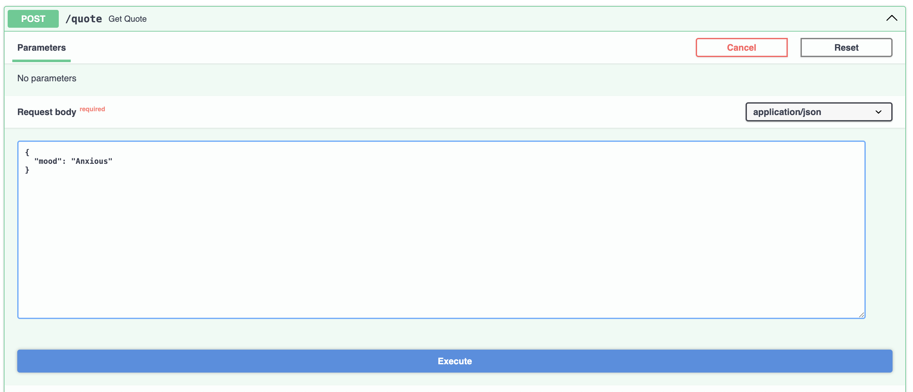
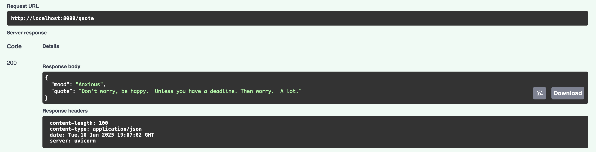
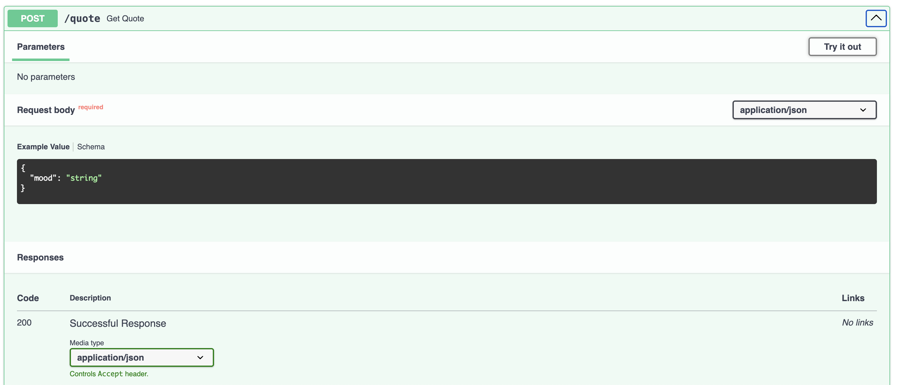

# Sarcastic Quote Generator API (MaaS)

A RESTful **Model-as-a-Service** built with FastAPI and Gemini, serving sarcastic, demotivational quotes tailored to your mood. Perfect for existential humor, self-deprecating laughs, or just roasting your motivation.


---

## Features

- **Google Gemini Integration** – Powered by `gemini-1.5-flash`
- **FastAPI Backend** – Blazing fast Python web framework
- **.env Support** – Secure API key management
- **Swagger UI** – Interactive auto-generated docs
- **Few-shot Prompting** – Highly sarcastic, intentionally bad advice

---

## What is Model-as-a-Service (MaaS)?

**Model-as-a-Service (MaaS)** is a cloud-based approach to deploying machine learning models via APIs, allowing developers to integrate intelligent capabilities into applications without handling infrastructure or model training directly.

This project demonstrates MaaS using **Google Gemini** and **FastAPI**, but the same architecture can be adapted to other large language models (LLMs) like OpenAI's GPT, Anthropic's Claude, or open-source models hosted via Hugging Face or Vertex AI.

Key benefits:

- Easy plug-and-play API for AI services
- Reusable and composable for multiple frontends (web, mobile, CLI)
- Scalable and secure when deployed on cloud platforms

---

## Prerequisites

- Python 3.9+
- A Google Cloud API key with Generative AI access  
  ➡️ [Get it from Google AI Studio](https://makersuite.google.com/app)

---

## Quick Start

```bash
# 1. Clone this repo (you can rename the folder)
git clone https://github.com/pritiyadav888/Create-Your-First-Model-as-a-Service-MaaS-using-Gemini-FastAPI.git your-custom-folder-name
cd your-custom-folder-name

# Replace `your-custom-folder-name` with any name you prefer for your project directory.

# 2. Create a virtual environment
python -m venv venv
source venv/bin/activate  # or .\venv\Scripts\activate on Windows

# 3. Install dependencies
pip install -r requirements.txt

# 4. Create your .env file
echo 'GOOGLE_API_KEY="your_key_here"' > .env

# 5. Run the API
uvicorn main:app --reload
```

---

# API Documentation

## Swagger UI

Once running, go to [http://127.0.0.1:8000/docs](http://127.0.0.1:8000/docs) to try the API live.

---

## Sample curl Request

```bash
curl -X POST "http://127.0.0.1:8000/quote" \
     -H "Content-Type: application/json" \
     -d '{"mood": "motivated"}'
```

### Expected Response

```json
{
  "mood": "motivated",
  "quote": "Don't let yesterday take up too much of today, because today will probably suck too."
}
```

---

## Project Structure

```bash
sarcastic-maas/
├── main.py           # FastAPI app
├── prompts.py        # Few-shot prompt configuration (optional)
├── .env              # API key config (not committed)
├── requirements.txt  # Dependencies
```

---

## Sample Query & Output

### Request Example



### Response Example



### Swagger UI



---

## About the Author

Built with love and sarcasm by [Priti Yadav](https://www.linkedin.com/in/priti-yadavml/)

---

## Support This Project

If this made you chuckle, cry, or raise an eyebrow:

<p align="left">
  <a href="https://www.buymeacoffee.com/pritiyadavN">
    
  </a>
</p>
