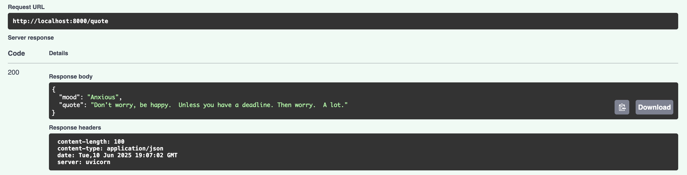

# Sarcastic Quote Generator API (MaaS)

A RESTful **Model-as-a-Service** built with FastAPI and Gemini, serving sarcastic, demotivational quotes tailored to your mood. Perfect for existential humor, self-deprecating laughs, or just roasting your motivation.


---

## Features

- **Google Gemini Integration** – Powered by `gemini-1.5-flash`
- **FastAPI Backend** – Blazing fast Python web framework
- **.env Support** – Secure API key management
- **Swagger UI** – Interactive auto-generated docs
- **Few-shot Prompting** – Highly sarcastic, intentionally bad advice

---

## What is Model-as-a-Service (MaaS)?

**Model-as-a-Service (MaaS)** is a cloud-based approach to deploying machine learning models via APIs. It allows you to:

- Abstract away infrastructure setup
- Use pre-trained models like Gemini, GPT, or Claude
- Serve models via HTTP endpoints

MaaS makes it possible for anyone to integrate AI into apps without needing to train or host the models manually.

---

## Full Tutorial: Build Your First MaaS App with Gemini + FastAPI

### Step 1: Understand the Goal

We’re building an API that takes a user's mood and returns a sarcastic, demotivational quote. The model is served via FastAPI and powered by Google’s Gemini model using a few-shot learning technique.

---

### Step 2: Set Up the Workflow

The folder structure looks like this:

```bash
Project/
├── main.py           # FastAPI app
├── prompts.py        # Prompt examples and system instructions
├── .env              # API key config (excluded from version control)
├── requirements.txt  # Dependencies
```

Install dependencies:

```bash
pip install -r requirements.txt
```

---

### Step 3: Load and Configure Gemini

In `main.py`, we load the API key and initialize the Gemini model:

```python
from dotenv import load_dotenv
import google.generativeai as genai

load_dotenv()
api_key = os.getenv("GOOGLE_API_KEY")
genai.configure(api_key=api_key)
model = genai.GenerativeModel(
    "gemini-1.5-flash",
    system_instruction=SYSTEM_PROMPT
)
```

This sets up the connection to Google Gemini and configures it with your system-level prompt.

---

### Step 4: Define User Intent with Few-Shot Examples

In `prompts.py`, we use **few-shot prompting** to steer Gemini’s behavior:

```python
FEW_SHOT_EXAMPLES = [
    {"role": "user", "parts": ["My mood: Hopeful"]},
    {"role": "model", "parts": ["Quote: Shoot for the moon. Even if you miss, you’ll land in crippling student debt."]},
    # ... more examples ...
]
```

We’re showing Gemini how to behave by providing examples of what to do for different moods.

The `SYSTEM_PROMPT` adds constraints:

```python
SYSTEM_PROMPT = (
    "You are a cynical, sarcastic demotivational quote generator. "
    "Quotes must be punchy, under 25 words, and never say 'embrace'."
)
```

---

### Step 5: Create the API Endpoint

In `main.py`, the `/quote` endpoint takes a JSON payload with a mood and appends it to the few-shot examples:

```python
@app.post("/quote")
def get_quote(req: MoodRequest):
    mood = req.mood.strip()
    messages = FEW_SHOT_EXAMPLES + [
        {"role": "user", "parts": [f"My mood: {mood}"]},
        {"role": "model", "parts": ["Quote:"]},
    ]
```

Then Gemini generates a response:

```python
response = model.generate_content(messages)
quote = response.text.strip()
```

We clean up the quote and send it back to the user.

---

### Step 6: Test Your API

Run the server:

```bash
uvicorn main:app --reload
```

Try it out:

```bash
curl -X POST http://127.0.0.1:8000/quote \
     -H "Content-Type: application/json" \
     -d '{"mood": "motivated"}'
```

Expected output:

```json
{
  "mood": "motivated",
  "quote": "Don't let yesterday take up too much of today, because today will probably suck too."
}
```

---

## Swagger UI

Visit: [http://127.0.0.1:8000/docs](http://127.0.0.1:8000/docs)

Use the built-in docs to send requests and view responses live.

---

## Sample Query & Output

### Request Example


### Response Example



### Swagger UI


---

## About the Author

Built with love and sarcasm by [Priti Yadav](https://www.linkedin.com/in/priti-yadavml/)

---

## Support This Project

If this made you chuckle, cry, or raise an eyebrow:

<p align="left">
  <a href="https://www.buymeacoffee.com/pritiyadavN">
    
  </a>
</p>
